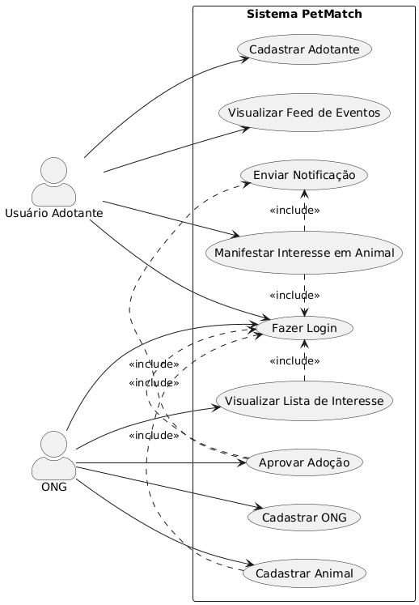

## Documentação de Casos de Uso

Este repositório contém o **Diagrama de Casos de Uso** da aplicação **PetMatch**. O diagrama serve como um mapa visual das funcionalidades do sistema, ilustrando as interações entre os usuários (chamados de "atores") e as principais ações que podem realizar na plataforma.

### Atores e Funcionalidades

O diagrama detalha as interações de dois atores principais:

#### **1\. Usuário Adotante**

O adotante é a pessoa que busca um animal para adoção. Suas principais interações são:

*   **Cadastrar Adotante:** Cria uma nova conta na plataforma.
*   **Fazer Login:** Acessa sua conta para utilizar as funcionalidades.
*   **Visualizar Feed de Eventos:** Navega por um feed com os eventos de adoção organizados pelas ONGs.
*   **Manifestar Interesse em Animal:** Demonstra interesse em um pet, entrando na fila de espera.

#### **2\. ONG**

A ONG é a organização responsável pelos animais e pelo processo de adoção. Suas principais interações são:

*   **Cadastrar ONG:** Cria uma conta para a organização.
*   **Fazer Login:** Acessa a conta da ONG.
*   **Cadastrar Animal:** Adiciona novos animais ao banco de dados da plataforma.
*   **Visualizar Lista de Interesse:** Acompanha a lista de usuários interessados em cada animal.
*   **Aprovar Adoção:** Conclui o processo de adoção de um animal para um adotante.

### Como Visualizar o Diagrama

O diagrama foi criado usando a linguagem **PlantUML**. Para visualizar o diagrama, você pode:

1.  Copiar o código-fonte PlantUML.
2.  Colar o código em uma ferramenta online, como o [PlantUML Web Server](https://www.google.com/search?q=https://www.plantuml.com/plantuml/uml/).
3.  Utilizar uma extensão PlantUML em seu editor de código (como o VS Code) para renderizar a imagem diretamente.

---

